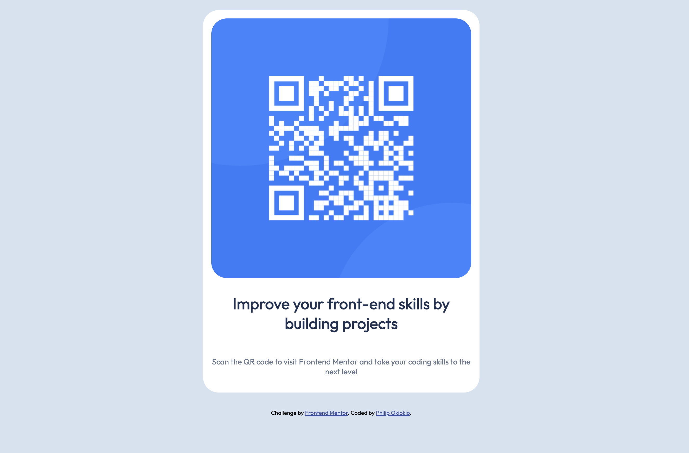

# Frontend Mentor - QR code component solution

This is a solution to the [QR code component challenge on Frontend Mentor](https://www.frontendmentor.io/challenges/qr-code-component-iux_sIO_H). Frontend Mentor challenges help you improve your coding skills by building realistic projects. 

## Table of contents

- [Overview](#overview)
  - [Screenshot](#screenshot)
  - [Links](#links)
- [My process](#my-process)
  - [Built with](#built-with)
  - [What I learned](#what-i-learned)

## Overview

### Screenshot

### Links

- Solution URL: [https://github.com/philipokiokio/qr-code-frontend-mentors](GitHub)
- Live Site URL: [Add live site URL here]

## My process

### Built with

- Semantic HTML5 markup
- CSS custom properties
- Flexbox
- CSS Grid
- Mobile-first workflow

**Note: These are just examples. Delete this note and replace the list above with your own choices**

### What I learned

I learnt CSS, it is easy to follow a material and hard to do on ones own. However coupled with GPT i was able to turn this around in a day.

